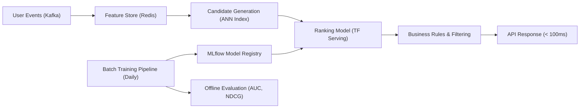

# Awesome Data Science & ML Interview Handbook 2026 📊

> Comprehensive technical interview preparation guide with real coding challenges, system design patterns, statistics deep dives, and ML case studies for Data Scientist, ML Engineer, and Analytics roles.

[](LICENSE)
[](https://www.python.org/)
[](https://www.lucebra.com)
[](CONTRIBUTING.md)

---

## 📑 Table of Contents
1. [Interview Process Roadmap](#1-interview-process-roadmap)
2. [Statistics & Probability Questions](#2-statistics--probability-questions)
3. [SQL Proficiency Challenges](#3-sql-proficiency-challenges)
4. [Python Coding Problems](#4-python-coding-problems)
5. [Machine Learning Case Studies](#5-machine-learning-case-studies)
6. [ML System Design Interview](#6-ml-system-design-interview)
7. [Behavioral & Business Questions](#7-behavioral--business-questions)
8. [Curated Learning Resources](#8-curated-learning-resources)
9. [Contributing](#9-contributing)

---

## 1. Interview Process Roadmap


---

## 2. Statistics & Probability Questions

### Q1: Central Limit Theorem in Practice
> **Question:** A website has an average session duration of 4.2 minutes with σ = 1.8. If you sample 100 sessions, what is the probability the sample mean exceeds 4.5 minutes?

**Solution:**
```python
from scipy import stats

mu, sigma, n = 4.2, 1.8, 100
se = sigma / (n ** 0.5)  # Standard Error = 0.18
z = (4.5 - mu) / se       # Z-score = 1.667

p_value = 1 - stats.norm.cdf(z)
print(f"P(X̄ > 4.5) = {p_value:.4f}")  # ≈ 0.0478
```

### Q2: A/B Test Sample Size Calculator
> **Question:** Design a function to calculate required sample size for an A/B test.

```python
import math
from scipy.stats import norm

def ab_test_sample_size(
    baseline_rate: float,
    minimum_detectable_effect: float,
    alpha: float = 0.05,
    power: float = 0.80
) -> int:
    p1 = baseline_rate
    p2 = baseline_rate + minimum_detectable_effect
    p_avg = (p1 + p2) / 2.0

    z_alpha = norm.ppf(1 - alpha / 2)
    z_beta = norm.ppf(power)

    n = (
        (z_alpha * math.sqrt(2 * p_avg * (1 - p_avg))
         + z_beta * math.sqrt(p1 * (1 - p1) + p2 * (1 - p2)))
        / (p2 - p1)
    ) ** 2

    return math.ceil(n)

# Example: 10% baseline CTR, want to detect 2% lift
print(ab_test_sample_size(0.10, 0.02))  # ≈ 3,842 per group
```

### Q3: Common Statistics Gotchas

| Trap | Correct Understanding |
| :--- | :--- |
| "p < 0.05 means 95% chance of being true" | p-value = P(data \| H₀), not P(H₀ \| data) |
| "More data always helps" | Diminishing returns; bias > variance at large N |
| "Correlation implies causation" | Always check for confounders; use causal inference |
| "Accuracy is the best metric" | Imbalanced classes → F1, AUC-ROC, or Precision@K |

---

## 3. SQL Proficiency Challenges

### Challenge: Cohort Retention Analysis
```sql
-- Monthly user retention by signup cohort
WITH user_cohort AS (
    SELECT
        user_id,
        DATE_TRUNC('month', created_at) AS cohort_month,
        DATE_TRUNC('month', activity_date) AS activity_month
    FROM user_activity
),
cohort_size AS (
    SELECT cohort_month, COUNT(DISTINCT user_id) AS total_users
    FROM user_cohort
    GROUP BY cohort_month
)
SELECT
    uc.cohort_month,
    EXTRACT(MONTH FROM AGE(uc.activity_month, uc.cohort_month)) AS months_since_signup,
    COUNT(DISTINCT uc.user_id) AS active_users,
    ROUND(
        COUNT(DISTINCT uc.user_id)::DECIMAL / cs.total_users * 100, 2
    ) AS retention_pct
FROM user_cohort uc
JOIN cohort_size cs ON uc.cohort_month = cs.cohort_month
GROUP BY uc.cohort_month, months_since_signup, cs.total_users
ORDER BY uc.cohort_month, months_since_signup;
```

### Challenge: Running Revenue with Window Functions
```sql
SELECT
    order_date,
    daily_revenue,
    SUM(daily_revenue) OVER (
        ORDER BY order_date
        ROWS BETWEEN 6 PRECEDING AND CURRENT ROW
    ) AS rolling_7d_revenue,
    AVG(daily_revenue) OVER (
        ORDER BY order_date
        ROWS BETWEEN 29 PRECEDING AND CURRENT ROW
    ) AS moving_30d_avg
FROM (
    SELECT
        DATE(created_at) AS order_date,
        SUM(amount) AS daily_revenue
    FROM orders
    WHERE status = 'completed'
    GROUP BY DATE(created_at)
) daily_totals
ORDER BY order_date;
```

---

## 4. Python Coding Problems

### Problem: Efficient Feature Hasher
```python
from collections import defaultdict
import hashlib

class FeatureHasher:
    """Memory-efficient feature hashing for high-cardinality categoricals."""

    def __init__(self, n_features: int = 2**18):
        self.n_features = n_features

    def _hash(self, value: str) -> int:
        return int(hashlib.md5(value.encode()).hexdigest(), 16) % self.n_features

    def transform(self, records: list[dict]) -> list[dict]:
        result = []
        for record in records:
            hashed = defaultdict(float)
            for key, value in record.items():
                feature_name = f"{key}={value}"
                idx = self._hash(feature_name)
                hashed[idx] += 1.0
            result.append(dict(hashed))
        return result
```

### Problem: Streaming Percentile Estimator
```python
import heapq

class StreamingMedian:
    """O(log n) median computation for streaming data."""

    def __init__(self):
        self.low = []   # Max-heap (negated values)
        self.high = []  # Min-heap

    def add(self, num: float):
        heapq.heappush(self.low, -num)
        heapq.heappush(self.high, -heapq.heappop(self.low))
        if len(self.high) > len(self.low):
            heapq.heappush(self.low, -heapq.heappop(self.high))

    @property
    def median(self) -> float:
        if len(self.low) > len(self.high):
            return -self.low[0]
        return (-self.low[0] + self.high[0]) / 2.0
```

---

## 5. Machine Learning Case Studies

### Case Study: Course Completion Prediction
> **Scenario:** Predict whether a student will complete an online course within 30 days of enrollment.

**Approach:**
```
1. Define Target:    completed_within_30d (binary)
2. Feature Sources:  enrollment data, first-week engagement, demographics
3. Key Features:
   - lessons_completed_week_1 / total_lessons (progress ratio)
   - avg_session_duration_minutes
   - days_since_last_login
   - device_type (mobile vs desktop)
   - has_downloaded_resources (boolean)
4. Model Selection:  XGBoost with 5-fold stratified CV
5. Evaluation:       AUC-ROC (primary), Precision@80% recall (business)
6. Business Impact:  Trigger engagement emails for at-risk students
```

---

## 6. ML System Design Interview

### Design: Real-Time Course Recommendation Engine


**Key Discussion Points:**
- **Cold start:** Content-based features for new users; popularity-based for new courses.
- **Latency:** Two-stage retrieval (fast ANN recall → precise re-ranking).
- **Feedback loops:** Log impressions & clicks, retrain on implicit signals.
- **Fairness:** Ensure diverse instructor/topic representation in results.

---

## 7. Behavioral & Business Questions

| Category | Sample Question | What They're Evaluating |
| :--- | :--- | :--- |
| **Product Sense** | "How would you measure the success of a new AI-powered search feature?" | Metric selection, guardrail metrics, experiment design |
| **Technical Trade-offs** | "When would you choose logistic regression over a deep learning model?" | Practical judgment, interpretability vs accuracy |
| **Stakeholder Communication** | "The model accuracy dropped 3% after retraining. How do you communicate this?" | Data storytelling, risk framing, action planning |
| **Ethics** | "Your recommendation model has higher engagement for clickbait content. What do you do?" | Values alignment, long-term thinking |

---

## 8. Curated Learning Resources

### Open-Source References
- [Chip Huyen — ML Interviews Book](https://huyenchip.com/ml-interviews-book/) — Comprehensive ML interview preparation.
- [Eugene Yan — ML System Design](https://eugeneyan.com/writing/system-design-for-discovery/) — Real-world system design patterns.
- [Mode Analytics SQL Tutorial](https://mode.com/sql-tutorial/) — Interactive SQL learning.

### Accredited Courses with Verifiable Certificates
- 🐍 **Python AI Engineering:** [Zero to Hero with GPT-3 & Python](https://www.lucebra.com/courses/zero-to-hero-with-gpt3-python-building-cuttingedge-ai) — Build production AI pipelines with verifiable certificate.
- 🤖 **LLM Comparison & Evaluation:** [AI Chatbots: ChatGPT vs Claude](https://www.lucebra.com/courses/ai-chatbots-compare-top-ai-tools-chatgpt-vs-claude-vs) — Practical LLM benchmarking frameworks.
- 🗣️ **Communication & Presentation:** [TJ Walker's Complete Communication Suite](https://www.lucebra.com/instructor/tjwalker) — Master technical communication for interviews and stakeholder presentations.

---

## 9. Contributing

We welcome contributions from data scientists, ML engineers, and hiring managers:
1. Fork this repository.
2. Create a feature branch (`git checkout -b feature/add-sql-challenge`).
3. Ensure all solutions include clear explanations and edge case handling.
4. Submit a Pull Request describing your contribution.

---
*Distributed under CC0-1.0 by Lucebra Global Education ([www.lucebra.com](https://www.lucebra.com))*
